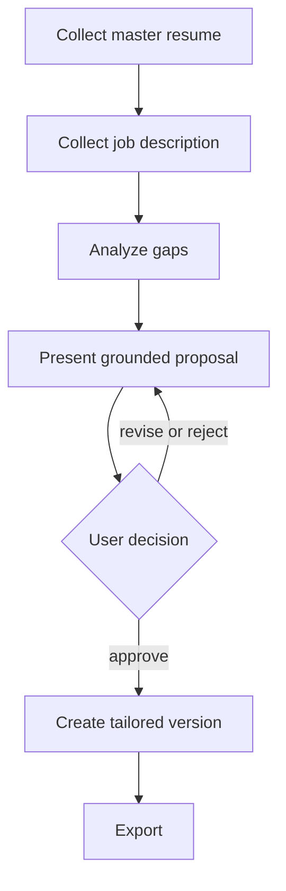
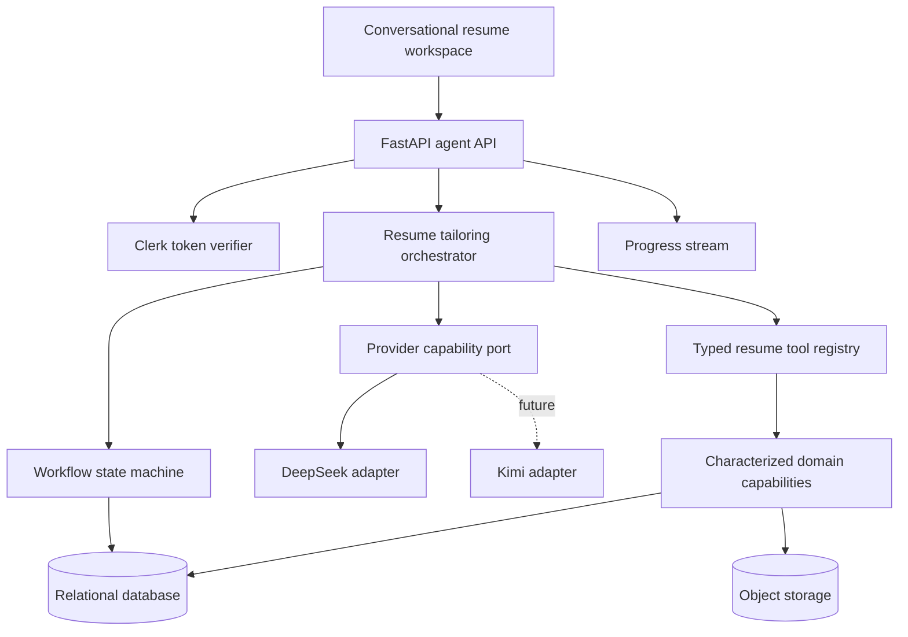
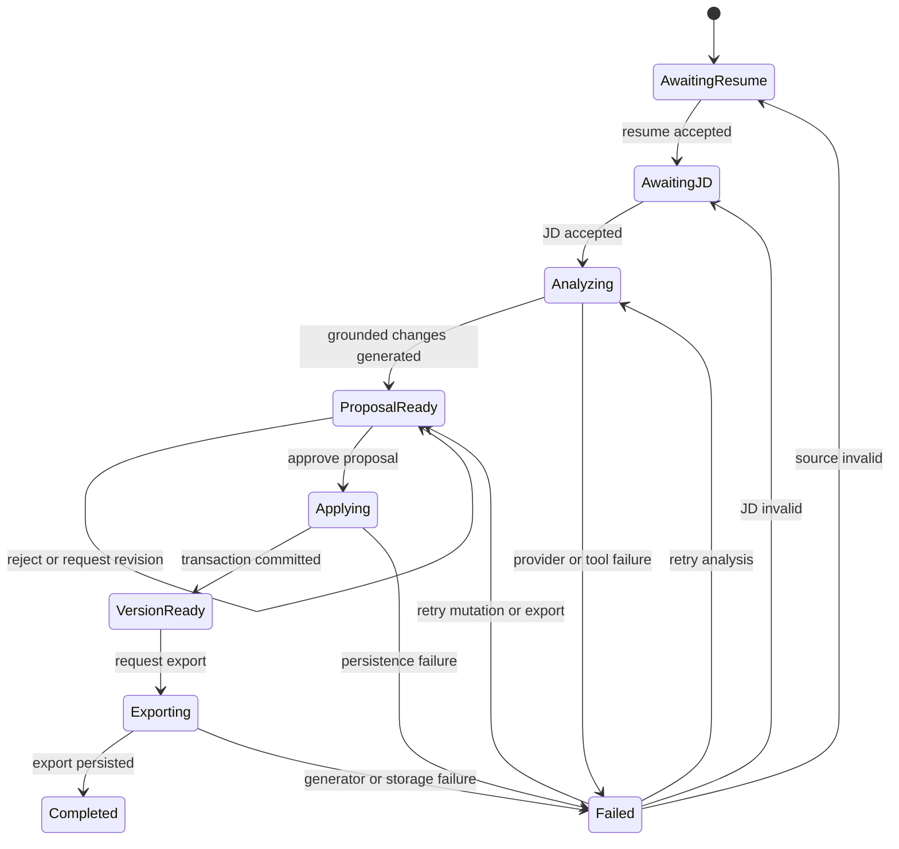
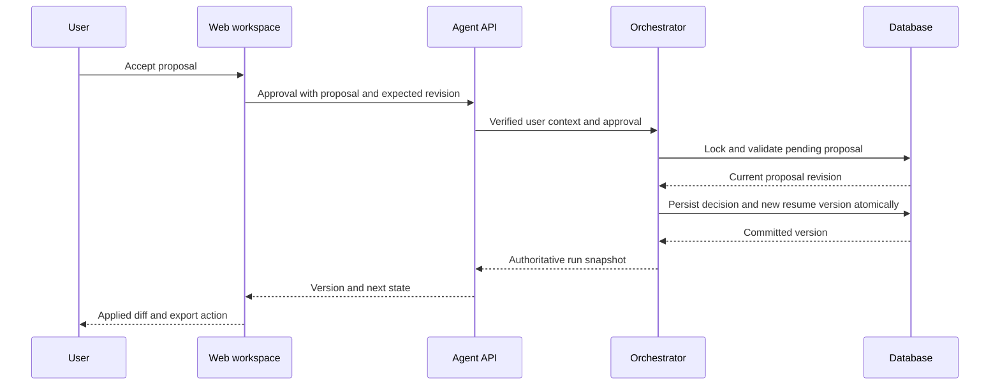

# Conversational Resume Tailoring Agent - Plan

## Goal Capsule

- **Objective:** Replace the legacy multi-page resume workflow with one authenticated conversational agent that turns a master resume and a job description into a user-approved tailored resume.
- **Product authority:** This plan owns the first complete JD-specific resume-tailoring loop, including persistent conversation and version history.
- **Authority order:** Product Contract requirements and settled decisions override the Planning Contract; the Planning Contract overrides unit-local implementation preferences.
- **Stop conditions:** Stop if implementation requires autonomous resume mutation, expands the first version into LeetCode coaching, or cannot enforce user ownership at every persistence boundary.
- **Execution profile:** Deep, phased code migration with characterization-first repair, security-sensitive integration coverage, and end-to-end browser verification.
- **Tail ownership:** The implementing owner carries baseline repair through rollout verification and legacy resume-page retirement.
- **Open blockers:** None. Model identifiers and production credentials remain deployment configuration, not planning blockers.

---

## Product Contract

### Summary

Build a single-agent conversational product that analyzes a signed-in user's master resume against one job description, proposes grounded changes, waits for approval, and exports a persistent tailored version.

### Problem Frame

The repository currently exposes resume work as separate upload, JD, optimization, chat, and export surfaces.
The backend is still a route-to-use-case service despite its `agent` name, so it has no agent execution loop, tool contract, durable workflow state, or approval boundary.
The merged code also fails its current Python compilation and import checks, which prevents the existing capabilities from serving as a reliable migration base.

### Key Decisions

- **One agent over multiple cooperating agents.** (session-settled: user-directed — chosen over workflow-only and multi-agent product shapes: one conversational coach should own the complete user experience.) Governs R1, R3, R4.
- **Conversation replaces the legacy workflow.** (session-settled: user-directed — chosen over keeping pages primary or retaining an assistant sidebar: the product should have one primary interaction model.) Governs R1, R9.
- **Every mutation requires approval.** (session-settled: user-directed — chosen over risk-tiered or autonomous editing: the user must control the resume's factual record.) Governs R5, R6, R7.
- **Reuse capabilities inside a deterministic loop.** (session-settled: user-approved — chosen over light wrapping or a greenfield rewrite: reuse lowers migration risk while explicit states make the workflow testable.) Governs R2, R3, R4.
- **Persist the complete signed-in experience.** (session-settled: user-directed — chosen over outcome-only or session-only storage: users need to resume work across devices.) Governs R8.
- **DeepSeek first, provider-neutral by design.** (session-settled: user-directed — chosen over OpenAI-specific or DeepSeek-only integration: future providers such as Kimi must not require business-layer changes.) Governs R10, R11.
- **Configuration switching before runtime administration.** (session-settled: user-directed — chosen over a first-version admin switcher: provider portability matters now, while dynamic configuration operations do not.) Governs R11.

### Actors

- A1. **Signed-in job seeker:** Supplies source material, evaluates proposed changes, confirms mutations, and downloads tailored versions.
- A2. **Resume tailoring agent:** Maintains workflow context, invokes allowed capabilities, explains findings, and pauses at approval boundaries.
- A3. **LLM provider adapter:** Supplies the model capabilities required by the agent without owning product rules or user data authority.

### Requirements

**Conversational product**

- R1. The signed-in user completes the JD-specific resume-tailoring journey through one primary conversation instead of navigating the legacy resume pages.
- R2. Existing parsing, JD analysis, gap analysis, resume optimization, persistence, and export capabilities are reused when they meet the new tool contracts and corrected or replaced when they do not.
- R3. The agent may interpret user intent and select allowed read or analysis capabilities, while the workflow controls which stage and actions are valid.
- R4. A tailoring run follows the ordered stages of source collection, analysis, proposal, approval, version creation, and export, with recoverable handling for missing or rejected inputs.



**Approval and factual integrity**

- R5. Analysis and read-only retrieval may proceed without confirmation, but no formal resume content may change without an explicit user approval tied to the displayed proposal.
- R6. Every proposal shows the affected content, the suggested replacement, and the reason it improves fit with the submitted JD without inventing unsupported facts.
- R7. The user can accept, reject, or request revision of a proposal, and the system records the decision before continuing.

**Identity, persistence, and recovery**

- R8. The system persistently associates each master resume, JD, conversation, proposal, confirmation record, tailored version, and export with the authenticated user so the work can resume across devices.
- R9. The conversational experience provides structured difference review, proposal decisions, version history, and version recovery rather than relying on plain chat text alone.

**Provider portability**

- R10. The first production model integration uses DeepSeek through a provider-neutral capability contract that prevents provider-specific request and response details from entering agent or resume business rules.
- R11. A deployment setting selects the active provider, each conversation records and retains its selected provider and model identity, and adding a compatible provider such as Kimi does not change the tailoring workflow.

**Migration baseline**

- R12. The existing backend must compile, import, start, and expose its supported baseline capabilities consistently before those capabilities are accepted as agent tools.
- R13. The authenticated backend derives user identity from verified credentials and rejects cross-user access; placeholder identities such as `anonymous` and `user_1` are not valid production behavior.

### Key Flows

- F1. Start or resume tailoring
  - **Trigger:** A1 starts a new conversation or opens an existing one on another device.
  - **Actors:** A1, A2.
  - **Steps:** The system authenticates A1, loads authorized context, and resumes the current stage or requests the next missing input.
  - **Outcome:** A1 sees the correct tailoring state without reconstructing prior work.
  - **Covers:** R1, R4, R8, R13.
- F2. Analyze source material
  - **Trigger:** A1 has supplied a usable master resume and JD.
  - **Actors:** A1, A2, A3.
  - **Steps:** A2 invokes parsing and analysis capabilities, identifies material gaps, and prepares grounded proposals.
  - **Outcome:** A1 receives actionable changes connected to the submitted sources.
  - **Covers:** R2, R3, R4, R6, R10.
- F3. Review and apply a proposal
  - **Trigger:** A2 has a proposed resume change.
  - **Actors:** A1, A2.
  - **Steps:** A2 displays the difference and rationale; A1 accepts, rejects, or requests revision; only acceptance creates formal version content.
  - **Outcome:** Every persisted mutation has a matching user decision.
  - **Covers:** R5, R6, R7, R9.
- F4. Export a tailored version
  - **Trigger:** A1 has approved the required proposal set.
  - **Actors:** A1, A2.
  - **Steps:** A2 creates a durable tailored version and offers an export derived from that version.
  - **Outcome:** A1 can download the result and later recover the exact version and its decision history.
  - **Covers:** R4, R8, R9.

### Acceptance Examples

- AE1. **Covers R4, R8.** Given a signed-in user completed analysis on one device, when the same user opens the conversation on another device, then the agent resumes at the proposal stage with the same master resume and JD context.
- AE2. **Covers R5, R7.** Given the agent proposes a rewritten experience bullet, when the user rejects it, then no formal resume version contains that rewrite and the rejection is recorded.
- AE3. **Covers R5, R6.** Given the model suggests a metric not present in the source material, when the proposal is prepared, then the unsupported metric is not written and the agent asks for evidence or omits it.
- AE4. **Covers R9.** Given two approved versions exist for the same JD, when the user opens version history, then the user can distinguish, inspect, and restore either version.
- AE5. **Covers R11.** Given deployment configuration changes the default provider, when an existing conversation continues, then it retains its recorded provider and new conversations use the new default.
- AE6. **Covers R13.** Given one authenticated user requests another user's resume or conversation, when authorization is evaluated, then access is denied without exposing the other user's content.

### Success Criteria

- A signed-in user can complete the full master-resume-to-export journey without using a legacy resume page.
- Every persisted resume mutation is traceable to a displayed proposal and an affirmative user decision.
- A tailoring conversation resumes correctly across devices with its source material, workflow stage, decisions, and versions intact.
- DeepSeek can be replaced by a compatible provider adapter without changing the agent workflow or resume business rules.
- The backend passes its agreed compilation, import, startup, and contract verification before migration is considered ready for feature work.

### Scope Boundaries

**Deferred for later**

- Administrator runtime provider switching, provider health dashboards, and automatic cross-provider failover.
- Redis-backed distributed execution, background queues, and multi-instance coordination.
- User-selectable providers or models.

**Outside this product's first-version identity**

- General resume coaching without a target JD.
- Job search, LeetCode coaching, interview preparation, and multi-agent collaboration.
- Autonomous modification of formal resume content.

### Dependencies / Assumptions

- The existing Clerk-based frontend identity can be extended into verifiable backend authentication and ownership enforcement.
- A durable relational database and durable file storage are available for production; Redis is not required for the first deployment shape.
- DeepSeek exposes the model capabilities needed for the selected agent tool and structured-output contracts; planning must verify the exact model before implementation.
- Legacy capabilities are candidates for reuse, not trusted dependencies, until they satisfy R12.

### Outstanding Questions

**Deferred to Planning**

- Which DeepSeek model and capability profile satisfy the agent's structured output and tool-use needs?
- Which legacy use cases can be wrapped safely, and which should be replaced after the baseline repair?
- Which production relational database and file-storage deployment choices fit the target environment?
- What migration window, compatibility redirects, or removal sequence should retire the legacy resume pages?

### Sources / Research

- `agent/src/agent_service/main.py` shows the current FastAPI route composition and lifecycle wiring.
- `agent/src/agent_service/api/schemas/__init__.py` contains unresolved merge markers and currently fails Python compilation.
- `agent/src/agent_service/config.py` references an unavailable settings symbol during import and contains merged configuration duplication.
- `agent/src/agent_service/wiring.py` references a missing enhanced LLM implementation.
- `agent/src/agent_service/infra/storage/models.py` already models master resumes, JD analyses, resume versions, chat sessions, and optimization decisions.
- `apps/web-legacy/src/middleware.ts` and `apps/web-legacy/src/app/layout.tsx` show Clerk on the frontend, while backend routes still use placeholder identities.
- `agent/pyproject.toml` and `agent/requirements.txt` do not declare a Redis dependency and currently disagree on core dependency versions.

---

## Planning Contract

**Product Contract preservation:** changed: Scope Boundaries only — the existing LeetCode API is now an explicit non-regression surface; LeetCode coaching remains deferred to a separate Product Contract and plan.

### Key Technical Decisions

- KTD1. **Repair and characterize before migration.** Restore one install contract, one import style, clean schema exports, and a passing startup smoke test before accepting legacy behavior into agent tools. Governs R2, R12.
- KTD2. **Use an explicit persisted state machine around a bounded agent loop.** The workflow owns legal transitions and mutation gates; the model may choose only from tools allowed in the current state. Do not add an agent framework in the first version. Governs R3-R5.
- KTD3. **Expose business capabilities through typed tool adapters.** Tool metadata declares input validation, read-only or mutating effect, required workflow states, and result type; routes and model prompts do not call infrastructure services directly. Governs R2-R7.
- KTD4. **Separate provider capability contracts from provider transports.** The agent depends on messages, tool calls, structured results, usage, and error categories. DeepSeek receives its own adapter, while compatible HTTP mechanics may be shared without treating vendor behavior as identical. Governs R10, R11.
- KTD5. **Validate structured output in the application boundary.** DeepSeek strict tool schema mode is beta and supports a constrained JSON Schema subset, so core correctness cannot depend on beta-only server validation. Invalid tool arguments are rejected before tool execution. Governs R3, R5, R10.
- KTD6. **Pin provider and model per conversation.** Deployment configuration selects defaults for new conversations; persisted runs keep their original provider and model until completion. Governs R8, R11.
- KTD7. **Verify Clerk tokens in FastAPI and scope every query by subject.** Authentication extracts the verified Clerk subject and validates token provenance; repositories require that subject for reads and writes. Governs R8, R13.
- KTD8. **Normalize workflow records instead of storing the whole run in one JSON message list.** Keep immutable messages, runs, proposals, decisions, versions, and exports as separately addressable records with transaction boundaries around approvals. Governs R5-R9.
- KTD9. **Use storage ports with durable production and local development adapters.** Production uses an S3-compatible object store; local development uses the filesystem behind the same ownership-aware contract. Governs R8, R9.
- KTD10. **Stream progress, persist authoritative state.** The API may stream assistant text and progress events, but clients recover from the persisted run snapshot rather than treating the stream as the source of truth. Governs R4, R8, R9.
- KTD11. **Replace legacy resume navigation only after parity gates pass.** The new workspace becomes primary after upload, analysis, approval, version, and export checks succeed; the independent LeetCode API remains covered by regression tests. Governs R1, R9, R12.
- KTD12. **Expose one run-scoped browser contract under `/api/v1/agent`.** The new frontend uses authenticated run commands, snapshots, histories, exports, and a resumable SSE event feed. The SSE client uses authenticated fetch streaming rather than putting a Clerk token in the URL or relying on native `EventSource`, which cannot attach the required bearer header. The frontend does not call the internal tool registry or legacy capability routes directly. Governs R1-R9, R13.

### High-Level Technical Design

#### Component topology



The API authenticates first and passes a verified user context into the application layer.
The orchestrator loads the persisted run, derives the allowed tools from state, asks the provider for the next bounded action, validates tool arguments, executes the tool, and persists the transition.
The frontend renders stream events for responsiveness and reloads the authoritative snapshot after reconnects or completed mutations.

#### Workflow lifecycle



Only approval may enter `Applying`.
Retries return to the last safe persisted state and do not replay a committed mutation.

#### Approval sequence



Stale, duplicate, rejected, or foreign-user approvals cannot create a version.

### Output Structure

```text
agent/src/agent_service/
  agent/
    orchestrator.py
    state_machine.py
    tool_registry.py
    tools/
  application/
    ports/
      llm.py
      object_storage.py
    services/
  api/
    auth.py
    routes/agent.py
    schemas/agent.py
  infra/
    llm/
      registry.py
      deepseek_provider.py
      transports/
    storage/
      migrations/
      object_store.py
agent/tests/
  unit/
  integration/
  contract/
apps/web-legacy/src/
  app/dashboard/resume/agent/
  components/resume-agent/
  lib/api/
  types/agent.ts
apps/web-legacy/tests/
  unit/
  e2e/
```

The tree declares module ownership, not exact implementation filenames.
Existing capabilities may remain in their current modules when characterization proves they already satisfy a port.

### Sequencing

1. Establish the baseline and test harness in U1.
2. Build provider and identity foundations independently in U2 and U3 after U1.
3. Normalize persistence and durable storage in U4 after identity contracts exist.
4. Characterize and adapt resume capabilities in U5 after U1, U2, and U4.
5. Build the persisted orchestrator and approval transaction in U6.
6. Expose the agent API in U7, then replace the frontend workflow in U8.
7. Run parity, LeetCode non-regression, rollout, and documentation gates in U9.

### System-Wide Impact

- **Authentication:** Every resume, JD, run, proposal, version, export, stream, and file operation is scoped to a verified Clerk subject.
- **Data lifecycle:** Browser and process memory cease to be authoritative; relational records and owned object metadata support cross-device recovery.
- **External APIs:** DeepSeek errors, timeouts, rate limits, malformed tools, and usage normalize behind a provider port. LeetCode remains independent.
- **Frontend and operations:** The workspace reloads persisted snapshots; readiness separates database, storage, and provider status; startup makes no paid call.
- **Agent parity:** UI and Agent use the same typed capabilities, so no UI-only mutation bypasses approval.

### Risks and Mitigations

| Risk | Impact | Mitigation |
|---|---|---|
| Hidden legacy conflicts | Baseline expands | Characterize first; inventory failures and never swallow imports. |
| Provider differences | Invalid actions | Contract tests, local validation, bounded tools, conversation pinning. |
| Route-only auth | Cross-user exposure | Require subject context in repositories/storage and test foreign IDs. |
| Approval retries | Duplicate versions | Revision checks, idempotency, locking, transactions, uniqueness. |
| Disconnects | Duplicate work | Persist transitions and reload snapshots before retrying. |
| SQLite concurrency gap | Production races | Run migration and approval concurrency tests on PostgreSQL. |
| Resume migration breaks LeetCode | Adjacent regression | Preserve its proxy and add API/browser regression tests. |
| Resume/JD content leaks through logs or streams | User PII exposure | Log resource IDs and error categories instead of source text; owner-scope snapshots, events, exports, and downloads. |
| Malicious or oversized uploads | Resource exhaustion or parser abuse | Enforce byte limits and detected-type checks before parsing; reject empty or unsupported documents with stable client errors. |

### Sources and Research

- DeepSeek tool calls: `https://api-docs.deepseek.com/guides/tool_calls`.
- Clerk token verification: `https://clerk.com/docs/reference/backend/verify-token`.
- `agent/src/agent_service/domain/ports.py` and `infra/llm/llm_manager.py` show the incomplete, provider-coupled baseline.
- Resume/JD routes use process memory; `apps/web-legacy/src/app/dashboard/resume/**` uses `sessionStorage`.
- `apps/web-legacy/src/app/api/leetcode/route.ts` is the independent LeetCode regression surface.

### Current Interface Inventory

The current FastAPI composition root applies Clerk bearer authentication to every registered resume route. The route modules then expose the following HTTP surface.

| Current endpoint | Current behavior | Persistence and ownership | Decision for the agent workspace |
|---|---|---|---|
| `GET /health` | Public process health | None | Keep for operational health only. |
| `POST /api/v1/parse/resume` | Parses an uploaded PDF, DOCX, or nominal DOC | No durable source record | Reuse the parser behind the orchestrator; replace this browser contract with run-scoped source upload. |
| `POST /api/v1/master/resume` | Creates a master resume | Process memory; subject tagged | Replace with repository-backed run source commands. |
| `GET /api/v1/master/resume` | Returns one master resume | Process memory; subject filtered | Do not use as the workspace snapshot. Keep only if a separate master-resume editor remains necessary. |
| `PUT /api/v1/master/resume` | Replaces one master resume | Process memory; subject filtered | Do not let the workspace bypass proposal approval through this route. |
| `POST /api/v1/jd/analyze` | Analyzes and stores one JD | Process memory; subject tagged | Reuse analysis behind the orchestrator; expose its result in the run snapshot. |
| `POST /api/v1/tailor/resume` | Produces a tailored-resume record from master/JD IDs | Process memory; subject checked | Supersede with proposal generation. It lacks the persisted approval boundary. |
| `GET /api/v1/tailor/resume/{tailored_id}` | Reads one generated tailored record | Process memory; subject checked | Supersede with run snapshot, proposal history, and version queries. |
| `POST /api/v1/api/resume/enhance` | Rewrites one description | No persistence or approval | Retire from the new workspace; the typed proposal tool owns this behavior. |
| `POST /api/v1/api/resume/enhance-summary` | Rewrites one summary | No persistence or approval | Retire from the new workspace for the same reason. |
| `POST /api/v1/api/resume/build/` | Builds a preview-shaped resume | No persistence; incomplete dependency wiring | Do not reuse as an agent API. |
| `POST /api/v1/api/resume/build/validate` | Validates legacy form input | No persistence | Replace with typed command validation at the agent boundary. |
| `POST /api/v1/api/resume/build/preview` | Returns inline HTML | No persistence | Replace with a frontend-rendered preview from an authoritative version snapshot. |
| `POST /api/v1/api/resume/generate` | Returns PDF or DOCX bytes from request content | No durable export metadata | Reuse generators behind `export_approved_resume`; expose version-scoped export creation and download. |

The doubled `/api/v1/api/...` paths come from route-local `/api` prefixes combined with the composition-root `/api/v1` prefix. They are legacy contracts, not the naming pattern for new routes.

Several current routes also project stale schema fields such as `PersonalInfo.name` and `Education.description`, while the active domain models use `PersonalInfo.fullname` and no education description field. U7 must not present these routes as supported workspace dependencies until their contract tests pass or they are retired.

### Internal Capabilities Without Browser Interfaces

| Existing internal capability | Current owner | What already exists | Missing public boundary |
|---|---|---|---|
| Owner-scoped run persistence | `agent/src/agent_service/infra/storage/workflow_repository.py` | Create/load runs; append messages; create proposals; record decisions; create/restore versions; create exports | No route or response schema exposes any operation. |
| Durable export storage | `agent/src/agent_service/application/services/export_storage.py` | Stores bytes through the object-storage port and records metadata | No create-export or authenticated download endpoint. |
| Typed resume tools | `agent/src/agent_service/tool_registry.py`, `agent/src/agent_service/tools/resume_tools.py` | Parse, analyze JD, propose tailoring, and export approved content with effects and state gates | Internal Python registry only; browsers must invoke it through the orchestrator. |
| Provider registry and pinned identity | `agent/src/agent_service/infra/llm/registry.py`, workflow records | Configurable provider lookup and persisted run provider/model fields | No run creation command binds deployment defaults to a new run. |
| Approval persistence | `WorkflowRepository.decide_proposal` | Revision check, decision record, and idempotency uniqueness | Acceptance does not atomically materialize a version; no HTTP conflict contract exists. |
| Run recovery snapshot | `WorkflowRepository.load_run` | Messages, proposals, decisions, versions, and exports | No stable DTO, list-runs query, event cursor, or reconnect endpoint. |

### New Workspace Page-to-API Mapping

The first frontend release uses one route family: `/dashboard/resume/agent` for starting or resuming work and `/dashboard/resume/agent/[runId]` for the workspace. The workspace may use panels and dialogs, but it does not reintroduce upload, JD, optimize, chat, and export as separate navigation steps.

| Workspace region or user action | Required browser contract | Current status | Backend work owner |
|---|---|---|---|
| Run list and new-run entry | `GET /api/v1/agent/runs`; `POST /api/v1/agent/runs` | Missing | U7 over U6 run creation/query services |
| Resume source panel | `POST /api/v1/agent/runs/{run_id}/resume` multipart upload; snapshot projection of parsed master resume | Missing; parser and storage exist internally | U6 command plus U7 route/schema |
| JD input and analysis panel | `POST /api/v1/agent/runs/{run_id}/job-description`; snapshot projection of analysis | Missing; analyzer exists internally | U6 command plus U7 route/schema |
| Conversation timeline and command composer | `POST /api/v1/agent/runs/{run_id}/messages`; `GET /api/v1/agent/runs/{run_id}` | Missing; message persistence exists | U6 orchestrator plus U7 command/query routes |
| Progress and reconnect indicator | `GET /api/v1/agent/runs/{run_id}/events?after={sequence}` using SSE | Missing entirely | U6 durable event semantics plus U7 stream |
| Evidence-backed proposal cards | Snapshot `proposals[]` with revision, affected content, replacement, JD rationale, source evidence, evidence request, and status | Partial internal models; no DTO and `evidence_request` is not persisted | U4/U6 persistence adjustment plus U7 schema |
| Accept, reject, or request revision | `POST /api/v1/agent/runs/{run_id}/proposals/{proposal_id}/decisions` with decision, expected revision, and idempotency key | Repository method exists; atomic accepted-version creation is missing | U6 transaction plus U7 command route |
| Version history and restore | Snapshot `versions[]`; `POST /api/v1/agent/runs/{run_id}/versions/{version_id}/restore` with idempotency key | Repository create/restore exists; no API | U6 service plus U7 routes |
| Final resume preview | `GET /api/v1/agent/runs/{run_id}/versions/{version_id}`; snapshot identifies `current_version_id` | Missing DTO/query | U7 query route; U8 renders content locally |
| PDF/DOCX export and download | `POST /api/v1/agent/runs/{run_id}/versions/{version_id}/exports`; `GET /api/v1/agent/runs/{run_id}/exports/{export_id}/download` | Generator, storage service, and metadata exist internally | U6 export command plus U7 create/download routes |
| Authentication expiry and recovery | All calls attach Clerk bearer tokens; `401` prompts sign-in without discarding persisted run state | Backend auth exists; old frontend attaches no token | U7 error contract plus U8 authenticated API client |

Every command returns the authoritative run revision and either the updated snapshot or a resource identifier that the client immediately resolves to a snapshot. Conflicts use `409` for stale revisions or reused idempotency keys with different payloads. Foreign and absent owned resources use the same `404` response so ownership is not disclosed.

Run creation and list queries return newest-first results with bounded cursor pagination. Resume upload validates extension, detected document type, non-empty extracted content, and configured byte limits before parsing or persistence. Source submission persists the owned master-resume or JD record and attaches it to the run in one service boundary so a failed command cannot leave a run pointing at partial input.

### Frontend Replacement Boundary

The current files under `apps/web-legacy/src/app/dashboard/resume/` are reference material only. They implement a browser-memory sequence, hard-code the backend origin, omit Clerk bearer tokens, link to missing pages, and import a missing `@/lib/api-client`. U8 replaces their state and network layer instead of adapting those assumptions.

Reusable frontend foundations are limited to the Next.js App Router, Clerk integration in `layout.tsx` and `middleware.ts`, global styling, dashboard navigation, and the independent LeetCode route. The new API client reads the backend origin from environment configuration, obtains a Clerk token per request, normalizes API errors, and treats the persisted snapshot as the only workflow authority.

On wide screens, the conversation and current action occupy the primary column while sources, proposal context, and version/export controls occupy a secondary inspector. On narrow screens, the inspector becomes one accessible tabbed or drawer surface and the current required action remains ahead of history. Each region defines loading, empty, partial-analysis, recoverable error, stale-conflict, reconnecting, and completed states. The UI announces asynchronous state changes, preserves keyboard focus after proposal decisions, and never relies on color alone for status.

---

## Implementation Units

### U1. Restore a reproducible baseline

**Goal / trace:** Deterministic install, compile, imports, startup and CI (R2, R12; enables F1-F4). **Dependencies:** none.  
**Files:** Modify `agent/pyproject.toml`, `agent/requirements.txt`, configuration, composition root, wiring, route/schema exports, Docker/start scripts, `apps/web-legacy/package.json`, canonical lockfile and CI. Create backend import/startup smoke tests.  
**Approach:** Remove merge markers, missing/mixed imports, conflicts and swallowed registrations. Canonicalize on `pyproject.toml` and npm/`package-lock.json`; tests use fakes and no paid calls.  
**Scenarios / verification:** Clean installs; all packages import; routes register once; missing credentials fail clearly; clean frontend install/build and backend compile/startup pass in CI.

### U2. Introduce provider capabilities and DeepSeek

**Goal / trace:** Provider-neutral LLM capability layer and DeepSeek adapter (R10, R11; F2). **Dependencies:** U1.  
**Files:** Create `application/ports/llm.py`, provider registry, DeepSeek adapter, shared transport and `agent/tests/contract/llm/`; adapt or retire existing provider modules/manager.  
**Approach:** Implement KTD4-KTD6; normalize text, tools, usage, finish reasons and errors. No automatic fallback or Kimi adapter in v1.  
**Scenarios / verification:** Unknown providers fail startup; fake contracts cover text/tools; settings and secrets are safe; malformed tools never execute; timeout/rate/auth/server errors normalize; existing conversations remain pinned. Opt-in credentialed smoke proves one text and one tool round trip.

### U3. Enforce authenticated user context

**Goal / trace:** Clerk verification and mandatory ownership below routes (R8, R13; AE6). **Dependencies:** U1.  
**Files:** Create `api/auth.py`, `application/ports/identity.py`, auth unit and ownership integration tests; modify all active resume/JD/version/export/agent routes and configuration.  
**Approach:** Implement KTD7; verify signature, issuer, expiry, configured audience and authorized party. Never authorize from a request-body user ID.  
**Scenarios / verification:** Valid tokens scope access; invalid token variants fail; body IDs cannot override subject; missing context fails closed; foreign resources remain invisible across every resource family.

### U4. Persist workflow state and files

**Goal / trace:** Durable relational state and object storage (R5-R9, R13; AE1, AE2, AE4). **Dependencies:** U1, U3.  
**Files:** Modify storage models/database/repositories/files; create Alembic migrations, object-storage port/adapter, and migration/repository/storage contract tests.  
**Approach:** Implement KTD8-KTD9; persist runs, messages, proposals, decisions, provider identity, versions and exports. Production uses migrations, PostgreSQL and S3-compatible storage; development may use filesystem.  
**Scenarios / verification:** Fresh/prior schemas upgrade without loss; full owner reload works; rejection creates no version; restore preserves history; foreign access fails; adapters validate owner/key/type/size; failed metadata commits leave no broken export.

### U5. Characterize and adapt resume capabilities

**Goal / trace:** Typed tools for reliable parsing, analysis, tailoring and export (R2, R3, R6, R12; AE3). **Dependencies:** U1, U2, U4.  
**Files:** Modify relevant use cases and parsing/matching/NLP/generator modules; create `agent/tool_registry.py`, tool adapters, characterization fixtures/tests and tool-registry tests.  
**Approach:** Implement KTD3; separate reads from proposals/mutations, retain source evidence, and remove the missing `EnhancedLLMService` dependency.  
**Scenarios / verification:** PDF/DOCX normalize; bad files fail; JD analysis is stable; tool schemas/effects/states validate; disallowed tools cannot run; unsupported facts request evidence; approved versions export valid PDF/DOCX.

### U6. Build the persisted agent workflow

**Goal / trace:** Bounded orchestration, legal transitions, atomic approval and recovery (R3-R9, R11; AE1-AE5). **Dependencies:** U2-U5.  
**Files:** Create `agent/src/agent_service/agent/orchestrator.py`, `agent/src/agent_service/agent/state_machine.py`, run command/query services, durable event records, `agent/tests/unit/agent/`, and PostgreSQL approval/resume integration tests; modify workflow models, repository, migrations, and wiring.
**Approach:** Implement KTD2, KTD5, KTD6 and KTD8. Bind configured provider/model defaults at run creation, derive allowed tools from the persisted state, bound turns and tool calls, persist ordered events before publishing them, and make an accepted proposal decision plus its resume version one idempotent transaction. Add the evidence-request and event-sequence fields needed by the browser snapshot and reconnect contract.
**Scenarios / verification:** Inputs gate analysis; proposals create no version; rejection and revision requests record only decisions; acceptance creates exactly one version under retries and PostgreSQL concurrency; stale revisions return a typed conflict; reused idempotency keys replay the original result; provider/tool failures recover from the last safe state; restarts and second devices load an equivalent snapshot; event sequences stay ordered; provider pinning holds.

### U7. Expose authenticated agent APIs and streams

**Goal / trace:** Stable commands, queries, exports and reconnectable progress (R1, R4-R9, R13; AE1, AE2, AE4, AE6). **Dependencies:** U3, U6.  
**Files:** Create `agent/src/agent_service/api/routes/agent.py`, `agent/src/agent_service/api/schemas/agent.py`, `agent/tests/contract/api/test_agent_openapi.py`, and agent API/stream/idempotency integration tests; modify route exports, `agent/src/agent_service/main.py`, and wiring.
**Approach:** Implement KTD10 and KTD12. Expose the run, source, message, proposal-decision, version-restore, export, download, and SSE contracts in the page-to-API mapping. Keep internal tool names and provider payloads private. Commands mutate through U6 services; queries return owner-scoped snapshots; SSE resumes after a persisted sequence and sends only hints that cause snapshot reconciliation. Define stable `400`, `401`, `404`, `409`, `422`, and `5xx` response semantics in OpenAPI.
**Scenarios / verification:** Create and cursor-page authenticated runs; complete the resume-to-export API journey; reject empty, oversized, extension-mismatched, and unsupported resume files plus invalid JD text before persistence; require revision and idempotency on decisions/restores/exports; replay returns the original result; stale commands return `409`; authenticated fetch reconnect after an event cursor neither leaks tokens nor loses persisted events nor reruns tools; download metadata and bytes match; logs and public errors exclude resume/JD content and internals; every lookup denies foreign users; route paths contain no doubled `/api`; OpenAPI and ASGI tests pass.

### U8. Replace resume pages with one workspace

**Goal / trace:** Authenticated conversation plus structured artifacts (R1, R5-R9, R13; AE1-AE4, AE6). **Dependencies:** U7.  
**Files:** Create `apps/web-legacy/src/app/dashboard/resume/agent/page.tsx`, `apps/web-legacy/src/app/dashboard/resume/agent/[runId]/page.tsx`, `apps/web-legacy/src/components/resume-agent/`, `apps/web-legacy/src/lib/api/agent-client.ts`, `apps/web-legacy/src/types/agent.ts`, frontend unit-test configuration/tests, and `apps/web-legacy/tests/e2e/resume-agent.spec.ts`; modify resume entry/navigation, middleware, environment documentation, and package scripts.
**Approach:** Build one responsive workspace with a run selector, conversation timeline/composer, source/JD panel, progress/reconnect state, proposal diff cards with evidence, version history, resume preview, and export actions. Attach Clerk tokens through one API client, read the backend origin from configuration, reconcile all optimistic feedback against server snapshots, and never store authoritative workflow content in `sessionStorage`. Use semantic status/error components for keyboard and screen-reader access.
**Scenarios / verification:** Signed-out users redirect; signed-in users create or resume a run; PDF/DOCX upload and JD submission advance the visible stage; proposal evidence and missing-fact requests render; accept/reject/revise actions are explicit and double-submit safe; rejection creates no version; stale conflicts reload the snapshot; refresh and a second browser restore the same run; SSE reconnect avoids duplicate messages/actions; expired auth returns to sign-in while persisted work remains; history restore is non-destructive; PDF/DOCX downloads use server filenames/content types; narrow and wide layouts keep all primary actions reachable; keyboard-only proposal review works.

### U9. Retire legacy resume flow and protect adjacent surfaces

**Goal / trace:** Make the workspace primary while preserving LeetCode and rollback (R1, R9, R12). **Dependencies:** U1-U8.  
**Files:** Modify legacy resume routes and READMEs; create redirect, LeetCode regression and backend route-inventory tests; update CI.  
**Approach:** Implement KTD11. Redirect only after parity gates; keep `apps/web-legacy/src/app/api/leetcode/route.ts` and callers intact except narrowly required compatibility fixes.  
**Scenarios / verification:** Redirects do not loop and preserve authorized run links; old session state cannot overwrite the server; route inventory starts cleanly; valid/invalid/upstream-error LeetCode behavior and dashboard access remain; rollback restores navigation without reversing migrations.

---

## Verification Contract

| Gate | Command | Applies to | Passing signal |
|---|---|---|---|
| Python syntax | `python -m compileall -q src` from `agent/` | U1-U7, U9 | No syntax or merge-marker failures. |
| Backend tests | `python -m pytest` from `agent/` | U1-U7, U9 | Unit, characterization, contract, integration, migration, and smoke suites pass. |
| Backend startup | `python -m uvicorn agent_service.main:app --app-dir src` from `agent/` | U1, U7, U9 | App starts with test configuration and required routes register once. |
| Database migration | `python -m alembic upgrade head` from `agent/` | U4, U6 | Fresh and prior test schemas reach the expected head revision. |
| Frontend install | `npm ci` from `apps/web-legacy/` | U1, U8, U9 | Canonical lockfile installs without mutation. |
| Frontend lint | `npm run lint` from `apps/web-legacy/` | U1, U8, U9 | ESLint reports no errors. |
| Frontend unit tests | `npm test` from `apps/web-legacy/` | U8, U9 | Workspace and API-client tests pass. |
| Frontend build | `npm run build` from `apps/web-legacy/` | U1, U8, U9 | Next.js production build completes. |
| Browser E2E | `npm run test:e2e` from `apps/web-legacy/` | U8, U9 | Resume journey, reconnect, redirects, authorization, export, and LeetCode regression pass. |
| Credentialed DeepSeek smoke | opt-in provider smoke command documented by U2 | U2, U6 | One text and one tool-call round trip pass without exposing credentials. |

CI must run non-credentialed gates on every pull request.
PostgreSQL-backed migration and concurrency tests are required for U4 and U6.
Credentialed provider smoke remains an explicit pre-release gate and is not required for untrusted pull requests.

---

## Definition of Done

- The Product Contract remains intact except for the confirmed LeetCode non-regression clarification.
- U1-U9 satisfy their verification outcomes and cited test scenarios.
- No unresolved merge markers, missing critical modules, duplicate dependency definitions, or exception-swallowed route imports remain.
- The backend authenticates Clerk tokens and enforces owner scope in routes, repositories, streams, and object storage.
- The complete resume tailoring workflow persists and resumes across process restarts and browser devices.
- No formal resume mutation occurs without a current, recorded approval; duplicate approvals do not create duplicate versions.
- DeepSeek is the configured first provider, and the application layer contains no DeepSeek-specific request or response logic.
- Existing conversations retain their provider and model when deployment defaults change.
- The new workspace completes upload, JD analysis, proposal review, approval, version history, restore, and PDF/DOCX export.
- Legacy resume entry points redirect only after parity gates pass.
- The existing LeetCode API and its dashboard access pass regression tests; LeetCode coaching remains outside this plan.
- CI runs backend compile/tests and frontend install/lint/test/build/E2E gates from clean environments.
- Operational documentation covers required configuration, migrations, object storage, provider smoke testing, rollout, and rollback.
- Abandoned experiments, unused adapters, dead route registrations, debug prints, and migration scaffolding that is not part of the chosen design are removed from the final diff.

---

## Appendix

### 中文版

本节是上述英文方案的中文对照摘要，便于中文评审与实施交接。英文条目中的 R、F、AE、KTD、U 编号仍是唯一的追踪依据；如中英文出现歧义，以英文编号条目为准。

#### 目标与范围

把旧的多页面简历流程替换为一个登录后使用的单 Agent 对话工作区。用户提交主简历和 JD 后，Agent 可以自动分析并提出有来源依据的修改建议，但任何正式简历变更都必须先展示差异并获得用户明确确认。

第一版持久保存主简历、JD、对话、流程状态、修改提议、接受或拒绝记录、简历版本和导出文件，支持跨设备恢复。第一版保留现有 LeetCode 接口和仪表盘入口，但不把 LeetCode 辅导纳入本次 Agent 改造。

#### 核心技术决定

- **KTD1：先修复并固化基线。** 清理合并标记、缺失模块、导入混乱和依赖冲突，建立可重复的安装、编译、导入、启动与 CI 基线。
- **KTD2：使用持久化有限状态机约束单 Agent。** 模型只能从当前状态允许的工具中选择动作；第一版不引入 LangGraph 等 Agent 框架。
- **KTD3：业务能力通过类型化工具适配器暴露。** 每个工具声明输入校验、只读或变更属性、允许状态和结果类型。
- **KTD4–KTD6：Provider 能力与厂商传输分离。** DeepSeek 是首个生产 Provider；应用边界统一消息、工具调用、结构化结果、用量和错误分类。默认 Provider 由部署配置决定，每个对话固定自己的 Provider 与模型。未来接入 Kimi 时新增适配器，不改简历业务流程。
- **KTD7：FastAPI 验证 Clerk Token。** 后端从验证后的 subject 获取用户身份，所有数据库查询和对象存储操作都必须带用户作用域，不能相信请求体中的 user ID。
- **KTD8–KTD9：关系数据库保存业务状态，对象存储保存文件。** 消息、运行、提议、决定、版本和导出记录分别持久化。生产使用 S3 兼容存储，本地开发使用同一接口后的文件系统适配器。第一版不要求 Redis。
- **KTD10：流负责即时进度，持久化快照负责事实。** 断线重连后从服务端快照恢复，不能把浏览器内存或事件流当作权威状态。
- **KTD11：能力对齐后再退役旧页面。** 上传、分析、确认、版本、恢复和导出全部通过后，才把旧简历入口重定向到新工作区；LeetCode API 必须通过回归测试。

#### 实施单元

1. **U1 — 恢复可重复基线：** 统一 Python 与 npm 依赖契约，修复编译、导入和启动错误，增加后端冒烟测试、前端生产构建和 CI。
2. **U2 — Provider 能力层与 DeepSeek：** 建立厂商中立端口、Provider 注册表、DeepSeek 适配器和契约测试；不实现自动故障转移，也不在本单元实现 Kimi。
3. **U3 — 认证用户上下文：** 在 FastAPI 验证 Clerk Token，并把用户作用域传入服务、仓库和文件存储边界。
4. **U4 — 持久化流程和文件：** 使用 SQLAlchemy、Alembic、PostgreSQL 测试与对象存储端口，保存对话、提议、决定、版本和导出元数据。
5. **U5 — 固化并工具化旧能力：** 先用特征测试固定解析、JD 分析、定制和导出行为，再把可靠能力包装成 Agent 工具；移除缺失的 EnhancedLLMService 关键路径依赖。
6. **U6 — 实现持久化 Agent 工作流：** 建立有界 Agent 循环、合法状态转换、提议修订号、幂等确认事务、失败恢复和跨设备续接。
7. **U7 — 提供认证 API 与可恢复进度流：** 提供创建、恢复、消息、确认、版本和导出接口；流断开后从持久化事件位置继续。
8. **U8 — 替换为单一对话工作区：** 提供材料状态、对话、结构化差异、接受/拒绝/修改、版本历史、恢复与导出，并使用 Clerk Token 调用后端。
9. **U9 — 退役旧简历流程并保护相邻功能：** 在能力对齐后重定向旧入口，补充旧路由、LeetCode API 和仪表盘入口回归测试，并记录发布与回滚步骤。

#### 关键验收条件

- 登录用户可以在一个工作区完成主简历、JD、分析、提议审核、确认、版本管理和 PDF/DOCX 导出。
- 主简历、JD、对话、提议、决定、版本与导出记录在进程重启和跨设备登录后仍可恢复。
- 没有当前有效提议和明确确认时，不得创建正式简历版本；重复或并发确认只能产生一个版本。
- 任何用户都不能读取、修改、导出或删除其他用户的数据或文件。
- DeepSeek 是首个可用 Provider，但 Agent 和简历业务层不包含 DeepSeek 专属请求或响应逻辑。
- 修改部署默认 Provider 后，已有对话继续使用原 Provider 和模型，新对话使用新默认值。
- 后端编译、导入、启动、数据库迁移、单元/契约/集成测试，以及前端安装、测试、构建和浏览器端到端测试全部通过。
- 现有 LeetCode API、错误行为和仪表盘入口保持可用；LeetCode 辅导继续作为独立后续计划。

#### 已确认的当前问题

- `agent/src/agent_service/api/schemas/__init__.py` 含未解决的合并标记，当前 Python 编译会失败。
- `agent/src/agent_service/config.py` 引用了缺失的设置类型，应用导入会失败。
- `agent/src/agent_service/wiring.py` 和部分用例引用不存在的 `enhanced_llm.py`。
- LLM 端口与实现不一致，依赖文件存在重复、冲突版本和格式错误。
- 后端仍使用 `anonymous`、`user_1` 等占位身份，并把部分数据保存在进程内字典中。
- 前端仍把权威流程状态放在 `sessionStorage`，且存在硬编码本地后端地址。
- 当前依赖未声明 Redis；第一版架构也不以 Redis 为跨设备持久化前提。
