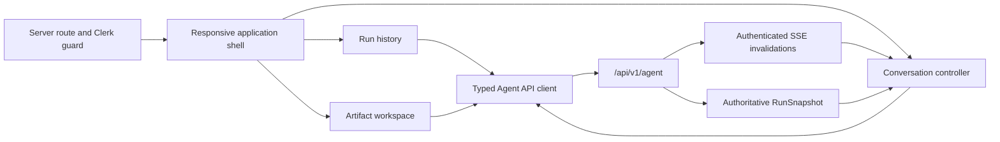

# Conversational Agent Frontend Refactor - Plan

## Goal Capsule

- **Objective:** Replace the legacy resume pages with a new `apps/web` application whose primary experience is a ChatGPT-style, authenticated resume-tailoring conversation.
- **Product authority:** `docs/plans/2026-08-04-001-feat-agent-resume-tailoring-plan.md` owns product behavior and the Agent API contract. This plan specializes its U8 and frontend cutover work.
- **Authority order:** The source plan Product Contract overrides this plan. This plan overrides unit-local implementation preferences.
- **Stop conditions:** Stop if implementation bypasses proposal approval, makes browser state authoritative, requires a backend contract change without updating its contract tests, or removes the LeetCode surface before replacement coverage exists.
- **Execution profile:** Standard frontend rebuild with API-contract-first tests, responsive browser verification, and an explicit cutover gate.
- **Tail ownership:** The frontend implementer owns the new application, automated browser coverage, migration documentation, and cutover readiness. Backend business behavior remains outside this plan.

---

## Product Contract

### Summary

Create a new Next.js application where a signed-in user starts or resumes a tailoring run through one conversation. The desktop workspace uses three columns: run history on the left, conversation in the center, and resume work artifacts on the right. The composer stays in the lower part of the center column. Narrow layouts keep the conversation primary and expose the side columns as accessible drawers.

### Problem Frame

The current `apps/web-legacy` application spreads resume work across upload, JD, optimization, chat, and export pages. It keeps workflow state in `sessionStorage`, contains a missing API client import, and does not consume the authenticated run-scoped API that now exists under `/api/v1/agent`. Extending those pages would preserve the wrong interaction and state model.

### Actors

- A1. A signed-in job seeker who creates, reviews, approves, restores, and exports a tailored resume.
- A2. The persisted Resume Agent workflow that supplies messages, state, proposals, versions, and exports.

### Key Decisions

- **Use a three-column desktop workspace.** (session-settled: user-directed — chosen over a conversation-only page and a two-column ChatGPT shell: run navigation, conversation, and resume artifacts must remain visible together.) Governs R1, R4, R7.
- **Build a clean application at `apps/web`.** (session-settled: user-directed — chosen over refactoring `apps/web-legacy` in place: the legacy page and browser-state assumptions should not shape the new architecture.) Governs R8, R10.

### Requirements

**Workspace and conversation**

- R1. A signed-in user can create, select, and resume runs from a left history column while the selected conversation remains in the center column.
- R2. The center timeline renders persisted user and assistant messages in sequence and provides explicit loading, empty, processing, reconnecting, error, and completed states.
- R3. The composer stays in the lower part of the center column, expands for multiline input, sends with Enter, inserts a line break with Shift+Enter, and prevents duplicate submission.
- R4. The right workspace exposes resume source, JD, proposals, preview, version history, restore, and export without turning them into separate primary pages.

**Approval and trust**

- R5. Proposal cards show the affected content, suggested replacement, JD rationale, source evidence, missing-evidence request, revision, and status before any decision action.
- R6. Accept, reject, and request-revision actions require an explicit user action and reconcile against the authoritative snapshot before the UI reports completion.
- R7. Version restore and export actions are explicit, retry-safe, and preserve access to earlier versions.

**Persistence, authentication, and recovery**

- R8. The browser treats `RunSnapshotResponse` as the only workflow authority and does not persist resume, JD, message, proposal, decision, or version content in `localStorage` or `sessionStorage`.
- R9. Every API request and event-stream connection uses the current Clerk bearer token; authentication expiry returns the user to sign-in without deleting persisted work.
- R10. Refresh, direct `/dashboard/resume/agent/{runId}` URLs, reconnect, and a second browser recover the same owned run from the backend.
- R11. Stale `409` responses and SSE events trigger bounded snapshot reconciliation without repeating commands or duplicating timeline entries.

**Responsive and accessible experience**

- R12. On narrow screens, the conversation stays primary and the run history and artifact workspace open as separate focus-managed drawers.
- R13. Keyboard and screen-reader users can navigate columns, operate proposal decisions, restore versions, export files, close drawers, and receive asynchronous status announcements.
- R14. Layout, state, and status remain understandable without relying on color alone, and the composer remains reachable when the viewport or software keyboard changes.

**Migration compatibility**

- R15. The new application preserves signed-in entry, the independent LeetCode API/dashboard access, and environment-driven backend configuration until legacy retirement is approved.

**Visual identity**

- R16. The interface uses a warm, professional career-coach identity with an ivory canvas, ink-colored text, muted teal primary actions, and restrained amber highlights instead of generic blue-purple AI gradients.
- R17. Visual hierarchy makes the conversation primary, artifacts secondary, and run navigation tertiary through width, surface tone, typography, and border contrast rather than decorative cards around every element.
- R18. Loading, success, warning, error, selected, disabled, and focus states remain distinguishable in normal, high-contrast, and reduced-motion environments.

### Key Flows

- F1. **Start or resume a run.** A1 opens the signed-in application, loads the newest run page or creates a run, and receives its authoritative snapshot. Covers R1, R8-R10.
- F2. **Supply source material.** A1 uploads a PDF or DOCX and submits a JD from the right workspace; the center timeline reflects Agent progress after snapshot reconciliation. Covers R2, R4, R8, R11.
- F3. **Continue the conversation.** A1 sends a message from the lower composer, sees pending feedback, and receives persisted Agent output without duplicate commands after reconnect. Covers R2, R3, R8, R11.
- F4. **Review a proposal.** A1 inspects evidence and chooses accept, reject, or revision request; the server snapshot determines the visible result. Covers R5, R6.
- F5. **Inspect, restore, and export.** A1 previews a version, restores an earlier version when needed, creates a PDF or DOCX export, and downloads it using server metadata. Covers R4, R7.

### Acceptance Examples

- AE1. **Covers R1, R10.** Given a signed-in user has existing runs, when they open the application on another browser, then the run list and selected run load from the backend without browser-stored workflow data.
- AE2. **Covers R3, R11.** Given a message command is pending, when the user presses Enter again or an SSE event arrives, then the client does not submit the message twice and the timeline contains one persisted message sequence.
- AE3. **Covers R5, R6.** Given a current proposal, when the user accepts it, then the UI shows success only after the returned or reloaded snapshot contains the decision and resulting version.
- AE4. **Covers R6, R11.** Given another client has changed a proposal revision, when this client submits a stale decision, then it reloads the snapshot, explains the conflict, and does not silently retry the mutation.
- AE5. **Covers R12-R14.** Given a phone-width viewport and keyboard-only navigation, when the user opens either side drawer and reviews a proposal, then focus is contained, Escape closes the drawer, focus returns to its trigger, and the composer stays reachable.
- AE6. **Covers R7.** Given an export is ready, when the user downloads it, then the saved filename and media type come from the authenticated server response.
- AE7. **Covers R16-R18.** Given the same workspace in wide and narrow layouts, when the user moves between conversation, proposal review, and a destructive or retry action, then the visual hierarchy, focus ring, status label, and motion treatment communicate priority without relying on color or gradients.

### Success Criteria

- A signed-in user completes upload, JD submission, conversation, proposal review, version inspection, restore, and export in the new application.
- Desktop users can use all three columns without route changes; narrow-screen users can reach equivalent actions through drawers.
- The shipped UI matches the warm career-coach visual contract across the shell, messages, composer, artifact panels, drawers, and all interactive states.
- Refresh and authenticated SSE reconnect recover from server snapshots without duplicate commands or messages.
- Unit, component, accessibility, production build, and end-to-end browser gates pass from a clean `apps/web` install.
- `apps/web-legacy` remains available for rollback until the new application passes parity and LeetCode regression gates.

### Scope Boundaries

**Included**

- New Next.js application shell, Clerk integration, API client, run routing, three-column workspace, responsive drawers, Agent state rendering, tests, and cutover documentation.
- The frontend projection of the existing `/api/v1/agent` routes and schemas.

**Deferred for later**

- Run rename, delete, search, folders, sharing, collaboration, voice input, attachments beyond one resume, themes beyond the initial light/dark token foundation, and offline mutation queues.
- Token-by-token assistant text streaming. The current SSE contract only announces persisted snapshot changes.

**Outside this plan**

- Changes to Agent workflow behavior, LLM providers, persistence schemas, proposal policy, resume generation, or backend authorization.
- A visual clone of ChatGPT branding. The interaction pattern is similar; the product retains its own identity.
- Deleting `apps/web-legacy` before the cutover gate passes.

### Dependencies and Assumptions

- `agent/src/agent_service/api/routes/agent.py` and `agent/src/agent_service/api/schemas/agent.py` are the browser contract.
- The backend origin is configured through `NEXT_PUBLIC_AGENT_API_ORIGIN`; production CORS permits the new frontend origin.
- Clerk 6.39.6 can supply a short-lived bearer token to browser fetch calls. The implementation must verify the exact supported token call against the installed package before building the shared client.
- The source plan's U7 is complete enough for contract-driven frontend work. Missing or unstable fields are backend contract blockers, not reasons to infer data in the UI.

---

## Planning Contract

**Product Contract preservation:** specialized from `docs/plans/2026-08-04-001-feat-agent-resume-tailoring-plan.md`; no upstream product behavior changed. The new `apps/web` location and three-column layout are session-settled frontend choices.

### Key Technical Decisions

- KTD1. **Pin the new application to the repository's proven frontend versions first.** Start with Next.js 15.5.22, React 19.1.4, Clerk 6.39.6, TypeScript 5, and Tailwind CSS 4 from `apps/web-legacy/package.json`. Do not combine this refactor with a Next.js 16 migration. Governs R8-R10, R15.
- KTD2. **Keep route and layout components server-first, then isolate the interactive workspace.** Root layout, metadata, and route guards stay outside the client bundle. The run controller, event connection, drawers, composer, and actions form explicit Client Component boundaries. Governs R1-R4, R9, R12.
- KTD3. **Use one typed browser client for all Agent operations.** Generate the transport schema from the backend OpenAPI document, then expose small frontend-owned DTO aliases and operations. The client obtains a Clerk token for each request, reads the backend origin from configuration, serializes multipart and JSON correctly, preserves download headers, and normalizes public HTTP errors. Components never call `fetch` directly. Governs R4-R11, R15.
- KTD4. **Model client state as a server snapshot plus ephemeral UI state.** Keep one selected `RunSnapshot`, in-flight command metadata, event cursor, drawer/tab selection, draft input, and announcements. Do not maintain independent client copies of messages, proposals, or versions. Governs R2, R6-R8, R10-R11.
- KTD5. **Treat authenticated SSE as an invalidation channel, not a permanent connection assumption.** Use bearer-authenticated `fetch` streaming for `/events?after=...`; parse event IDs, advance the cursor monotonically, coalesce snapshot reloads, and never replay a mutation from stream logic. The current route returns available events and closes, so the client reconnects only while the run is in `analyzing`, `applying`, or `exporting`, with a capped interval and backoff. Idle states do not poll. A future long-lived backend stream can reuse the same reader without changing domain state. Governs R2, R8-R11.
- KTD6. **Use Radix primitives for tabs and mobile drawers.** The right workspace groups Source, Proposals, Preview, and History/Export. On first load, the workflow state selects the relevant tab; after the user changes tabs, background updates indicate the required action without stealing their selection. Radix Tabs and Dialog own keyboard semantics and focus containment. Governs R4-R7, R12-R14.
- KTD7. **Make mutations pessimistic and idempotent.** Disable only the affected action, generate one idempotency key per user intent, retain it for an explicit retry, and replace visible domain state only with the returned or reloaded snapshot. Governs R3, R6-R7, R11.
- KTD8. **Test through public contracts and user behavior.** Use Vitest, React Testing Library, MSW, `jest-axe`, and Playwright. Mock the HTTP boundary in component tests and run the critical journey against a controllable backend or contract fixture in browser tests. Governs R1-R15.
- KTD9. **Treat every backend text and filename as untrusted display data.** Render messages, JD text, evidence, diffs, and resume fields through React text escaping. Do not use raw HTML. Sanitize `Content-Disposition` filenames before saving, configure restrictive browser security headers, and exclude tokens and user content from client telemetry. Governs R2, R4-R10, R15.
- KTD10. **Implement one tokenized warm-professional visual system.** Global CSS owns semantic color, typography, spacing, radius, elevation, motion, and focus tokens; components consume semantic utilities and do not introduce one-off hex values. The design favors quiet surfaces, precise borders, and readable type over gradients, glass effects, and card-heavy dashboard styling. (session-settled: user-directed — chosen over ChatGPT-style monochrome and dark technology styling: the product should feel like a calm professional coach.) Governs R16-R18.

### High-Level Technical Design

At viewport widths of 1280 CSS pixels and above, the layout uses three `minmax()` columns so the conversation owns the largest width. The left column is 240-288 pixels and the right inspector is 360-440 pixels. Below 1280 pixels, only the center column remains in document flow and both side columns use separate drawer triggers; this avoids squeezing the proposal diff or composer on tablets and small laptops. Each visible column owns its scroll container. The composer remains anchored within the center column rather than fixed to the browser window.

The run controller loads the route-selected snapshot, reads events after the latest sequence, and exposes commands through focused hooks. A successful command replaces the snapshot. An SSE event schedules one coalesced reload. A closed event response reconnects only for an active processing state. A `409` discards no draft input, reloads the snapshot, and surfaces a conflict message. A `401` stops reconnect attempts and routes to sign-in.

### CSS and Visual Design Contract

#### Design character

The application should feel calm, credible, and editorial. It supports high-stakes career work, so dense information uses strong typography and whitespace rather than saturated decoration. Avoid blue-purple gradients, glowing AI effects, colored icon circles, excessive pills, glassmorphism, and equal-weight dashboard cards.

#### Semantic palette

Use CSS custom properties expressed in OKLCH, with accessible sRGB fallbacks when required by tooling. The values below are the starting contract; implementation may make small contrast corrections without changing the named roles.

| Token role | Direction | Intended use |
|---|---|---|
| `canvas` | warm ivory, near `#F7F5EF` | Page background and empty breathing space. |
| `surface` | soft white, near `#FEFDF9` | Conversation and primary work surfaces. |
| `surface-muted` | warm stone, near `#EFEEE8` | Side columns, inactive tabs, code/evidence blocks. |
| `ink` | charcoal, near `#20231F` | Primary text and strong icons. |
| `ink-muted` | olive gray, near `#656A61` | Metadata, timestamps, helper copy. |
| `line` | warm gray, near `#D8D8D0` | Dividers and default controls. |
| `primary` | deep muted teal, near `#166B63` | Send, primary confirmation, selected navigation. |
| `primary-hover` | darker teal, near `#105850` | Hover and pressed primary actions. |
| `accent` | muted amber, near `#C48A2C` | Evidence, attention, and current-work indicators. |
| `success` | forest green, near `#2F6B45` | Accepted and completed states. |
| `warning` | ochre, near `#9A6818` | Reconnecting, stale, missing evidence. |
| `danger` | brick red, near `#A7443E` | Errors and destructive/reject actions. |
| `focus` | clear teal-blue, near `#167D8D` | Two-pixel focus ring with visible offset. |

Tinted status backgrounds use the same hue at low chroma and must retain at least WCAG AA text contrast. Status always includes an icon or text label. The first release supports a light theme; dark theme tokens are deferred, but component styles must use semantic variables so a later theme does not require component rewrites.

#### Typography

- Use Geist Sans for interface and conversation text. Use Geist Mono only for technical IDs or debug-like values that the product intentionally exposes.
- Default body text is 16 pixels with a 1.55-1.65 line height. Assistant responses may use a maximum readable line length of 72 characters.
- Page title uses 24-28 pixels and semibold weight. Section titles use 14-16 pixels and semibold weight. Metadata uses 12-13 pixels but never below 12 pixels.
- Prefer weight, spacing, and ink tone for hierarchy. Avoid all-uppercase navigation and overly bold message content.
- Chinese and Latin fallback stacks must preserve comparable x-height and line spacing; long Chinese content must wrap without artificial word breaks.

#### Spacing, shape, and elevation

- Use a four-pixel base spacing scale with common steps at 4, 8, 12, 16, 24, 32, and 48 pixels.
- Use 8-pixel radii for controls and small content blocks, 12-pixel radii for the composer and proposal groups, and 16-pixel radii only for drawers or major floating surfaces. Do not make every container rounded.
- Use one-pixel borders for persistent separation. Reserve shadows for the sticky composer, drawers, menus, and transient overlays.
- Minimum pointer target is 44 by 44 CSS pixels. Compact desktop controls may look smaller while retaining an equivalent hit area.

#### Three-column composition

- The left history column uses `surface-muted`, a right border, compact rows, and a quiet selected state with a teal leading marker. It should read as navigation, not a stack of cards.
- The center column uses `surface` and owns the strongest contrast. The timeline is centered within a readable maximum width while the sticky composer aligns to the same content width.
- The right workspace uses a subtle tinted surface and a left border. Tabs stay visually light; the active tab uses ink plus an underline instead of a filled pill.
- At widths below 1280 pixels, both side columns become full-height drawers on the same warm surface system. The drawer backdrop uses neutral ink with restrained opacity, not blur-heavy glass.

#### Conversation and composer

- Assistant messages are borderless editorial blocks with a small coach mark or label; do not wrap every response in a gray bubble.
- User messages use a compact, right-aligned pale-teal surface with ink text and a 12-pixel radius. Width stays content-driven up to 80% of the timeline.
- The composer is a white 12-pixel-radius surface with a warm border, subtle elevation, auto-growing textarea, attachment/source affordance when available, and a solid teal send button. Focus emphasizes the whole composer without shifting layout.
- Pending state uses a restrained three-dot or text indicator and respects `prefers-reduced-motion`. The UI does not simulate token streaming when the backend only provides snapshot changes.

#### Artifact and proposal styling

- Resume and JD sources use labeled sections with quiet dividers. Evidence uses an amber-tinted callout with a visible `Evidence` label.
- Proposal diffs use a two-part comparison: removed/original content gets a low-chroma brick tint and minus label; suggested content gets a low-chroma green tint and plus label. Text decoration is supplementary, never the only difference signal.
- Accept is the primary teal or success action. Reject is a bordered danger action. Request revision is a neutral secondary action. Button order and labels remain stable across cards.
- Version history is a vertical timeline with the current version emphasized by weight and marker. Export controls sit with the selected version rather than in a detached global card.

#### Motion and feedback

- Use 120-180 millisecond transitions for hover, focus, drawer, tab, and status changes. Use ease-out for entrances and ease-in for exits.
- Never animate layout height for long message content. Composer growth should follow input without bounce.
- Under `prefers-reduced-motion: reduce`, remove non-essential transforms and looping indicators while keeping immediate opacity or text feedback.
- Skeletons copy the final layout shape and appear only when the delay is perceptible. Short requests use inline progress instead of flashing skeletons.

### System-Wide Impact

- **Authentication:** Clerk token acquisition becomes part of every JSON, multipart, download, and SSE request. Tokens never enter URLs or logs.
- **Data lifecycle:** Server records replace `sessionStorage` as workflow authority. Only harmless UI preferences may later use browser storage.
- **Privacy and rendering:** Resume, JD, message, proposal, and evidence content are untrusted PII-bearing data. They stay out of URLs, analytics, client logs, error reporting payloads, and raw HTML sinks.
- **Browser security:** The new deployment needs a restrictive Content Security Policy, anti-framing policy, referrer policy, MIME sniffing protection, and HTTPS-only production API origins compatible with Clerk and the configured backend.
- **API compatibility:** Frontend types mirror the stable Pydantic response contract. Contract drift should fail generated fixtures or API-client tests before UI behavior diverges.
- **Accessibility:** The three independent scroll regions need landmarks, headings, skip/focus behavior, live regions, and predictable focus restoration.
- **Visual consistency:** CSS custom properties and semantic component variants are the single styling boundary. Snapshot states must not create ad hoc colors or layout patterns inside feature components.
- **Agent parity:** The UI calls the same run commands and reads the same snapshot used by the Agent workflow. It adds no UI-only resume mutation path.
- **Rollout:** The new app needs a distinct local port and deployment target until routing switches. Legacy remains the rollback surface through parity verification.

### Risks and Mitigations

| Risk | Impact | Mitigation |
|---|---|---|
| Three columns crowd medium screens | Proposal actions or composer become unreachable | Define wide, medium, and narrow behavior; collapse side columns before content overflows; test real viewport sizes. |
| Warm styling becomes low-contrast beige-on-beige | Readability and trust decline | Validate every text/control/status pair with automated contrast checks and manual high-contrast inspection. |
| Feature teams add one-off Tailwind colors | Visual system drifts into generic dashboard styling | Ban arbitrary color values in feature components, review semantic token use, and keep component variants centralized. |
| Multiple scroll containers fight auto-scroll | Users lose their reading position | Auto-scroll only when already near the timeline end; show a jump-to-latest control otherwise. |
| SSE reload storms | Excess requests and visible flicker | Coalesce events, keep a monotonic cursor, and allow one snapshot request at a time. |
| Current SSE response closes after available events | Idle reconnect becomes accidental polling | Reconnect only in active processing states, cap the interval, stop immediately on idle/auth/error states, and keep the reader compatible with a later long-lived response. |
| Expired Clerk token loops | Repeated `401` and reconnect churn | Stop streams and commands on `401`, preserve server work, and route through one auth-recovery path. |
| User or model text reaches an unsafe rendering sink | Stored XSS or content spoofing | Render structured text only, forbid raw HTML, test malicious payload fixtures, and enforce a restrictive Content Security Policy. |
| Resume/JD content enters telemetry or URLs | Persistent PII disclosure | Log resource IDs and error categories only; redact network errors; keep content and bearer tokens out of query strings, analytics, and replay tooling. |
| Cross-origin or mixed-content misconfiguration | Token-bearing requests leak or fail in production | Allowlist exact frontend/backend origins, require HTTPS in production, verify CORS preflight and security headers before cutover. |
| Malicious download filename | Confusing or unsafe local filename | Parse the authenticated response header, remove path/control characters, and fall back to a generated safe filename. |
| Stale decisions or double clicks | Duplicate or misleading approval | Use revision plus stable idempotency key, pessimistic feedback, disabled affected action, and `409` reconciliation. |
| New app omits legacy-adjacent behavior | Cutover regression | Keep legacy deployed, inventory entry routes and LeetCode behavior, and gate traffic switching on E2E parity. |
| Frontend types drift from Pydantic schemas | Silent missing states | Generate checked transport types from FastAPI OpenAPI and fail CI when regeneration produces an unreviewed diff. |
| Whole-run snapshots grow over time | Slow reconciliation and timeline rendering | Test a 500-message fixture, use stable keyed rows and deferred off-screen rendering, and treat a failed performance budget as evidence for a separate paginated backend contract. |

### Sources and Existing Patterns

- `docs/plans/2026-08-04-001-feat-agent-resume-tailoring-plan.md` defines the upstream Product Contract, KTD10-KTD12, API mapping, U8, and cutover constraints.
- `agent/src/agent_service/api/routes/agent.py` defines the current command, query, download, and SSE routes.
- `agent/src/agent_service/api/schemas/agent.py` defines snapshot, proposal, version, decision, and export fields.
- `agent/tests/contract/api/test_agent_openapi.py` is the route-surface contract pattern.
- `agent/tests/integration/api/test_agent_api.py` demonstrates snapshot recovery, SSE cursors, upload errors, ownership hiding, and stale-conflict semantics.
- `apps/web-legacy/src/app/layout.tsx`, `apps/web-legacy/src/middleware.ts`, and `apps/web-legacy/package.json` provide version and Clerk integration references only.
- Next.js Server and Client Components documentation, checked 2026-08-06: `https://nextjs.org/docs/app/getting-started/server-and-client-components`.
- No applicable repository learnings were found under `docs/solutions/`, and no root `STRATEGY.md` or `CONCEPTS.md` exists.

---

## Implementation Units

### U1. Scaffold the isolated frontend baseline

**Goal / trace:** Create a reproducible `apps/web` application without changing production traffic (R8-R10, R15; KTD1, KTD2).  
**Dependencies:** none.  
**Files:** Create `apps/web/package.json`, `apps/web/package-lock.json`, `apps/web/next.config.ts`, `apps/web/tsconfig.json`, `apps/web/eslint.config.mjs`, `apps/web/postcss.config.mjs`, `apps/web/src/app/layout.tsx`, `apps/web/src/app/globals.css`, `apps/web/src/styles/tokens.css`, `apps/web/src/styles/components.css`, `apps/web/src/app/page.tsx`, `apps/web/src/middleware.ts`, `apps/web/.env.example`, `apps/web/vitest.config.ts`, `apps/web/playwright.config.ts`, and `apps/web/src/test/`; modify root and frontend README instructions only where required.  
**Approach:** Pin KTD1 versions, enable strict TypeScript, configure path aliases, install Vitest/Testing Library/MSW/axe/Playwright plus the Radix Tabs and Dialog primitives, and carry Clerk provider/middleware behavior into the new app without copying legacy page state. Implement KTD10 semantic tokens and base component variants before feature styling. Define KTD9 security headers in `next.config.ts`. Keep the new app on a separate local port during migration.  
**Test scenarios:**

1. A clean install uses the committed lockfile without mutation.
2. Missing public Clerk or backend-origin configuration fails with a clear startup or signed-out state rather than calling a hard-coded URL.
3. Public landing and sign-in routes render without loading the Agent client bundle.
4. Protected routes redirect signed-out users and preserve the intended return URL.
5. Type, lint, unit-test, and production-build scripts run from `apps/web`.
6. Production responses include the planned security headers without blocking Clerk, the configured backend, fonts, or static assets.
7. Token contrast, focus-ring visibility, Chinese/Latin wrapping, reduced motion, and the prohibition on arbitrary feature colors have automated or reviewable checks.

**Verification:** Clean install, lint, typecheck, minimal layout tests, and production build pass independently of `apps/web-legacy`.

### U2. Implement the typed authenticated Agent client

**Goal / trace:** Provide one safe browser boundary for all run operations (R5-R11; AE2-AE4, AE6; KTD3, KTD5, KTD7).  
**Dependencies:** U1.  
**Files:** Create `apps/web/src/types/agent.ts`, `apps/web/src/types/generated/agent-openapi.ts`, `apps/web/scripts/sync-agent-openapi.mjs`, `apps/web/src/lib/api/agent-client.ts`, `apps/web/src/lib/api/errors.ts`, `apps/web/src/lib/api/sse.ts`, `apps/web/src/lib/api/idempotency.ts`, and corresponding `*.test.ts` files with MSW handlers and contract fixtures under `apps/web/src/test/fixtures/`.  
**Approach:** Generate the transport contract from FastAPI OpenAPI, expose stable frontend aliases, and fail CI when regeneration changes the checked artifact. Implement typed list/create/load/upload/JD/message/evidence/decision/version/restore/export/download functions, and inject token acquisition rather than importing Clerk inside the transport. Parse and sanitize filenames from `Content-Disposition`. Implement an abortable SSE reader with bearer headers, monotonic cursor handling, event parsing, bounded backoff, and explicit auth termination. Normalize failures to redacted categories before telemetry or display. Do not add a general data-fetching framework unless implementation proves the controller cannot remain small.  
**Test scenarios:**

1. JSON, multipart, download, and SSE requests use the configured origin and current bearer token without placing it in the URL.
2. `400`, `401`, `404`, `409`, `413`, `422`, and `5xx` responses normalize to stable client errors without exposing response internals.
3. One idempotency key remains stable for one decision, restore, or export intent and changes for a new intent.
4. SSE parsing handles split chunks, multiple events, comments, malformed frames, abort, reconnect cursor, and an expired token.
5. Duplicate or out-of-order event IDs never move the cursor backward or invoke a mutation.
6. Downloads preserve safe server filename and content type.
7. Regenerating the OpenAPI transport types produces no diff when the backend contract is unchanged and an intentional backend change fails the frontend contract gate until reviewed.
8. Malicious header values, HTML-like message content, and backend error text cannot create a path filename, raw HTML node, token disclosure, or user-content telemetry payload.

**Verification:** API-client and SSE unit suites pass with all network calls intercepted by MSW.

### U3. Build routing, run history, and the responsive shell

**Goal / trace:** Establish the signed-in three-column workspace and direct run recovery (R1, R10, R12-R15; AE1, AE5; KTD2, KTD6).  
**Dependencies:** U1, U2.  
**Files:** Create `apps/web/src/app/(authenticated)/dashboard/resume/agent/page.tsx`, `apps/web/src/app/(authenticated)/dashboard/resume/agent/[runId]/page.tsx`, `apps/web/src/components/shell/`, `apps/web/src/components/run-history/`, `apps/web/src/components/workspace/workspace-shell.tsx`, and component tests.  
**Approach:** Redirect `/dashboard/resume/agent` to the newest owned run or a clearly empty new-run state. Use route identity for the selected run. Because `RunSummary` has no title, label each history row as `Resume run · <localized created time>` plus its workflow state; do not load every snapshot to synthesize titles. Render semantic left navigation, central main region, and right complementary region at 1280 pixels and above. Below that threshold, expose history and workspace through separate accessible dialog drawers with visible triggers and focus restoration. Cursor-page run history without loading all runs at once.  
**Test scenarios:**

1. No runs shows an actionable empty state; creating a run navigates to its stable URL.
2. Selecting a run changes the route and reloads its owned snapshot.
3. Cursor pagination appends unique runs in server order and preserves the selection.
4. Runs with no title field remain distinguishable by localized creation time and workflow state without N+1 snapshot requests.
5. Direct run URLs recover on refresh; missing or foreign runs show the same non-disclosing not-found state.
6. Wide layout exposes all three landmarks; narrow layout exposes one main conversation and two independent drawer triggers.
7. Drawer focus containment, Escape handling, return focus, headings, and accessible names pass component and axe checks.
8. Visual regression snapshots cover the approved 1440-pixel three-column shell, 1024-pixel drawer layout, and 390-pixel mobile layout with no unintended gradient, glass, or card-grid styling.

**Verification:** Shell component tests and Playwright wide/narrow smoke scenarios pass.

### U4. Implement the conversation controller and composer

**Goal / trace:** Deliver the primary ChatGPT-style question-and-answer experience with resilient snapshot recovery (R2, R3, R8-R11; AE2, AE4; KTD4, KTD5, KTD7).  
**Dependencies:** U2, U3.  
**Files:** Create `apps/web/src/components/conversation/`, `apps/web/src/hooks/use-run-controller.ts`, `apps/web/src/hooks/use-agent-events.ts`, `apps/web/src/hooks/use-scroll-anchor.ts`, and focused tests.  
**Approach:** Initialize from `GET /runs/{runId}`, keep one authoritative snapshot, read SSE after `latest_event_sequence`, and coalesce invalidations into one reload. Reconnect a closed response only in `analyzing`, `applying`, or `exporting`; stop in every other state. Render messages by stable ID and sequence. Keep the composer visually anchored at the center-column bottom with a bounded auto-growing textarea. Preserve unsent drafts during reload and conflict recovery. Auto-scroll only when the reader is near the end; otherwise show a jump-to-latest control.  
**Test scenarios:**

1. Empty, loading, processing, reconnecting, offline-like network error, completed, and auth-expired states provide distinct feedback.
2. Enter sends, Shift+Enter inserts a newline, IME composition does not submit early, blank input is rejected, and an in-flight send cannot double-submit.
3. A successful command replaces the snapshot rather than appending a speculative authoritative message.
4. Several SSE events during one reload coalesce and ordered message IDs render once.
5. A closed event response reconnects with a capped interval only in active processing states and produces no idle polling loop.
6. A `409` preserves the draft, reloads state, announces the conflict, and never retries the command automatically.
7. Readers away from the timeline end keep their scroll position and can jump to the latest message.
8. The composer remains reachable at desktop, tablet, and mobile viewport heights, including a reduced visual viewport.
9. A 500-message snapshot keeps input interaction responsive and avoids eagerly painting off-screen message bodies; failure opens a backend-pagination follow-up instead of hiding messages client-side.
10. Assistant blocks, user bubbles, composer focus/pending/error states, and reduced-motion behavior match the CSS contract at desktop and mobile widths.

**Verification:** Controller/hook tests pass with fake timers and MSW; Playwright covers keyboard submission, reconnect, refresh recovery, and mobile composer reachability.

### U5. Implement the artifact workspace and guarded actions

**Goal / trace:** Complete source submission, grounded proposal review, preview, history, restore, and export (R4-R7, R13; AE3-AE6; KTD4, KTD6-KTD8).  
**Dependencies:** U2-U4.  
**Files:** Create `apps/web/src/components/artifacts/source-panel/`, `apps/web/src/components/artifacts/proposals/`, `apps/web/src/components/artifacts/preview/`, `apps/web/src/components/artifacts/history/`, `apps/web/src/components/artifacts/export/`, shared status/confirmation components, and tests.  
**Approach:** Organize the right workspace into semantic tabs while automatically indicating, not forcibly switching away from, the current required action. Validate obvious file/JD constraints before sending but treat server validation as authoritative. Render proposal diffs and evidence as structured escaped content. Scope pending state to the selected proposal or version. Confirm restore and export intents where consequences are non-obvious. Render version content as data; do not inject backend-provided HTML.  
**Test scenarios:**

1. Valid PDF/DOCX upload and valid JD submission update the snapshot; invalid type, empty input, oversize, and server validation errors remain recoverable.
2. Proposal cards expose original, replacement, rationale, evidence, missing-evidence request, revision, status, and accessible decision labels.
3. Accept, reject, and revision request send the current revision and one stable idempotency key; repeated clicks issue one request.
4. Rejection creates no visible version unless the server snapshot contains one; acceptance selects the returned current version.
5. Preview handles partial structured resume data without unsafe HTML or layout failure.
6. Restore keeps older history visible and handles conflict reconciliation without destructive optimistic updates.
7. PDF and DOCX export creation and download preserve server metadata, and retries reuse the original intent key.
8. Every action is keyboard reachable and async changes are announced without color-only status.
9. HTML, script, bidirectional-control, and oversized-text fixtures render as inert text and do not break proposal or preview layout.
10. Original/suggested diffs, evidence callouts, proposal actions, version timeline, and export controls use the specified semantic variants and remain understandable in grayscale and high-contrast modes.

**Verification:** Component and axe suites pass; Playwright completes upload-to-export, rejection, stale proposal, restore, and download scenarios.

### U6. Gate cutover and preserve rollback

**Goal / trace:** Make `apps/web` deployable as the primary frontend without losing adjacent surfaces (R15 and all success criteria; KTD8).  
**Dependencies:** U1-U5 and the source plan's backend U7 contract.  
**Files:** Create `apps/web/src/app/api/leetcode/route.ts` and the minimal signed-in LeetCode dashboard entry required by current behavior; modify deployment/CI configuration, root and `apps/web` documentation, environment examples, and routing configuration; create `apps/web/tests/e2e/agent-workspace.spec.ts`, `apps/web/tests/e2e/auth-recovery.spec.ts`, `apps/web/tests/e2e/responsive-accessibility.spec.ts`, and `apps/web/tests/e2e/leetcode-regression.spec.ts`; modify `apps/web-legacy` only for a reversible redirect after approval.  
**Approach:** Run the new app alongside legacy, verify parity against the run API, preserve the independent LeetCode proxy/dashboard behavior in the active frontend target, then switch traffic or entry links behind a reversible deployment change. Do not delete legacy code in this unit. Document the rollback target, required environment variables, CORS origin, and known deferred features.  
**Test scenarios:**

1. Signed-out, sign-in return, token expiry, and signed-in direct-run flows behave consistently in production-like configuration.
2. A complete upload-to-export run survives refresh and a second authenticated browser context.
3. Wide, medium, phone, keyboard-only, reduced-motion, and automated accessibility checks keep all primary actions reachable.
4. Legacy entry redirects do not loop and preserve a run URL when one exists.
5. LeetCode valid, invalid, and upstream-error behavior plus dashboard access remain available on the selected deployment target.
6. Switching back to the legacy target requires no database rollback and leaves persisted runs intact.

**Verification:** All non-credentialed CI gates pass from clean installs; a production-like smoke verifies Clerk, CORS, authenticated SSE, downloads, and rollback before traffic switches.

---

## Verification Contract

| Gate | Command | Applies to | Passing signal |
|---|---|---|---|
| Clean install | `npm ci` from `apps/web/` | U1-U6 | Lockfile installs without mutation or vulnerability workaround copied from legacy. |
| Lint | `npm run lint` from `apps/web/` | U1-U6 | ESLint reports no errors. |
| Typecheck | `npm run typecheck` from `apps/web/` | U1-U6 | Strict TypeScript reports no errors. |
| API contract | `npm run api:check` from `apps/web/` | U2-U6 | Generated OpenAPI transport types match the checked artifact. |
| Unit/component/a11y | `npm test -- --run` from `apps/web/` | U1-U6 | Vitest, Testing Library, MSW, axe, token, and contrast scenarios pass. |
| Production build | `npm run build` from `apps/web/` | U1-U6 | Next.js production build completes with required environment validation. |
| Browser E2E | `npm run test:e2e` from `apps/web/` | U3-U6 | Critical journey, reconnect, conflicts, downloads, auth recovery, responsive UI, and LeetCode regression pass. |
| Visual regression | `npm run test:visual` from `apps/web/` | U1, U3-U6 | Approved wide, tablet, mobile, proposal, composer, drawer, and status screenshots have no unexplained differences. |
| Backend contract | `python -m pytest tests/contract/api/test_agent_openapi.py tests/integration/api/test_agent_api.py` from `agent/` | U2-U6 | Route inventory and snapshot/SSE/conflict semantics remain compatible. |

CI runs install, lint, typecheck, unit/component/a11y, build, and browser smoke gates for `apps/web` before cutover. Production-only Clerk, CORS, SSE, and download smoke checks run against a non-user fixture account and contain no resume or JD content in logs.

---

## Definition of Done

- U1-U6 satisfy their cited requirements, acceptance examples, test scenarios, and verification outcomes.
- The source plan's approval, persistence, ownership, and Agent API decisions remain intact.
- `apps/web` is the canonical new frontend with reproducible install, strict typecheck, tests, and production build.
- Desktop uses the approved three-column layout; narrow screens provide equivalent history and workspace actions through accessible drawers.
- The warm professional CSS contract is implemented through semantic tokens, with no generic AI gradient, glassmorphism, or arbitrary feature-level color system.
- Conversation, composer, proposal diff, evidence, version, export, drawer, and status visuals pass contrast, reduced-motion, responsive, and visual-regression checks.
- The center composer stays in the lower part of the conversation column and remains reachable across supported viewport heights.
- Browser workflow state comes only from authenticated server snapshots; no authoritative resume content is stored in browser storage.
- Commands, authenticated SSE, conflict recovery, token expiry, reconnect, and downloads behave as specified without duplicate mutations.
- Proposal approval, rejection, revision request, restore, and export are explicit, keyboard accessible, and backed by idempotency/revision contracts.
- A complete run resumes after refresh and in a second authenticated browser context.
- The selected deployment target preserves LeetCode behavior and has a documented, tested rollback to `apps/web-legacy`.
- No dead scaffolding, copied legacy page state, debug logging of user content, unused dependencies, or abandoned UI experiments remain in the final diff.
